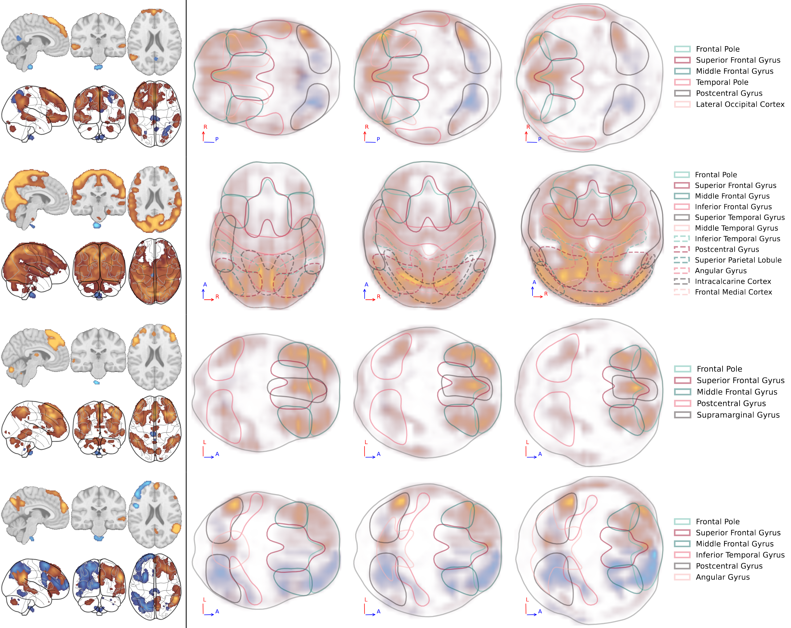

# NeuroMaps

The NeuroMaps design constitues a compact fingerprint for visualizating the brain activity in fMRI images, which was presented at EuroVIS 2026 in Nottingham. 
This repository contains the core methods and scripts to generate the results images presented within this paper. 

### Files

- [main.py](main.py): Example runner that loads nifti activity files and atlas and exports all example visualizations using the `neuromaps` module.
- [neuromaps.py](neuromaps.py): Core library. Public entrypoint `get_neuromap(atlas, loading, shape, ...)` computes the saliency map, label contours and projection vectors. This function should also constitute the entry point if the concept is used within another project. 
- [myatlas.nii](myatlas.nii): Example atlas file used by `main.py`. This is a manually simplified version of one of the [Harvard-Oxford cortical and subcortical structural atlases](https://neurovault.org/images/1699/), in which smaller areas have been removed/merged.

### Usage

After specifying the locations of the input files (loading and atlas) and the output directory of generated files in [main.py](main.py), the result images can be generated with: 

    python main.py

### Contributing

Contributions are welcome!  
Feel free to open issues or pull requests at 
https://github.com/lenxn/neuromaps.

### Acknowledgement

This work is partially supported by the HEREDITARY Project, as part of the European Union’s Horizon Europe research and innovation programme under grant agreement No GA 101137074. We also thank Mattia Veronese from the University of Padova and his group for their insightful discussions and valuable feedback.

When you use the tool for your project, please cite:

* Lengauer, S., Kantz, B., Waldert, P., Tussardi, G., Kohn, N., Schreck, T., NeuroMaps — A Compact Fingerprint for Analyzing Brain Activity EuroVis 2026, 2026. [doi:10.2312/evs.20261005](https://doi.org/10.2312/evs.20261005).

Bibtex:

    @inproceedings{10.2312:evs.20261005,
        booktitle = {EuroVis 2026 - Short Papers},
        editor = {Byska, Jan and Ottley, Alvitta and Waldner, Manuela},
        title = {{NeuroMaps - A Compact Fingerprint for Analyzing Brain Activity}},
        author = {Lengauer, Stefan and Kantz, B. and Waldert, P. and Tussardi, G. and Kohn, N. and Schreck, T.},
        year = {2026},
        publisher = {The Eurographics Association},
        ISBN = {978-3-03868-303-2},
        DOI = {10.2312/evs.20261005}
    }

